**Yaşar University**

**Spring, 2022-2023**

**SE2224 - Software System Analysis**

**Final Project Report**

| **Student Name:** | **Egemen BALLI** |
| --- | --- |
| **Student No:** | **20070006005** |
| **Department Name:** | **Software Engineering** |
| **Course Section No:** | **2** |

# **Table of Contents (****Do not change the Section Names!****)**

**1** **Introduction**

**2** **Requirements Definition**

**2.1** **Functional Requirements**

**2.2** **Nonfunctional Requirements**

**3** **Use Case Analysis**

**3.1** **Actors**

**3.2** **Scenarios**

**3.3** **Use Cases**

**3.4** **Relationships among Actors and Use Cases**

**3.5** **Use Case Diagram**

**4** **Behavioral Models**

**4.1** **Sequence Diagram**

**5** **Structural Models**

**5.1** **Class Diagram**

**6** **Process Modeling**

**6.1** **Data Flow Diagram (DFD)**

**7** **Final Version(s) of the Graphical User Interface(s)**

**8** **Conclusion and Future Work**

#

# 1 **Introduction**

Write an introduction of your project.

TaskPlanner project is a desktop application developed with a GUI by using swing library of Java which aims organizing the tasks in the user's daily life and job. The user and the data is stored in a MySQL database. This project aims to provide an efficient and organized way for the user to manage their tasks and enhance their productivity.

# 2 **Requirements Definition**

No explanation is needed here. Only complete the subsections.

## 2.1 **Functional Requirements**

Write all the functional requirements in your project.

-The user should be able to login to the system by entering their username and password.

-The system allows user create an account by clicking "Create Account" button on the LoginFrame. Then user will be redirected to create account frame so can enter their username and password.

-The user should be able to create a new task by filling in the required fields (Task Name, Short Description, Deadline, Priority, and Reminder Image) and clicking the "Insert task" button. The task should be saved to the database with an automatically assigned ID and entry date.

-The user should be able to view a list of all tasks in the database by clicking the "Show all tasks" button.

-The user should be able to select a task from the table view and delete it by clicking the "Delete task" button.

-The system should have "Update task" option that allows user to edit the tasks. The system will also update the database.

-The user should be able to select a task from the table view and view its associated image (if it has one) in a new frame.

-The system should have "Sort by priority" button to view a list of tasks with given deadline sorted by priority.

-The system should have use the "Filter tasks" button to view a list of tasks with deadlines within given date range.-Once the user is logged in, they should receive a notification message for tasks that have one day left to their deadlines. This information should be pulled from the database.

## 2.2 **Nonfunctional Requirements**

Write 5 nonfunctional requirements that can be suitable for your project.

-The system shall have interface easy to navigate, requiring no more than few minutes for new users.

-The system should be designed that is allowing the adding of new features or functionalities without changing existing code.

-The system should be designed in a way that makes it easy to adapt for different operating systems.

-The system interface should be user friendly. The text should be readable and the components should be aligned.

-The system should ensure to prevent unauthorized access to protect against common security threats.

# 3 **Use Case Analysis**

No explanation is needed here. Only complete the subsections.

## 3.1 **Actors**

Write and describe each actor.

**User:** User is the main actor of the system and can interact with various functionalities. User can login to the sytem by entering his/her username and password, create another account and perform activities such as insert, view, delete, update and filter a task. The user gives inputs to the system by using interface (GUI) components and gives output as updated data or notifications. The User's specific data about task is stored in the database.

**Database:** The database of the "TaskPlanner" system stores user information and task details.

**Scenarios**

Write 2 sample use case scenarios that can occur in your project.

**Use Case Scenario 1:** Inserting a New Task

**Actor:** User

When the user launches the "TaskPlanner" application, he or she logs in using his/her username and password. The user is presented with the MainFrame of the system, which displays various task management options. After that user fills in the required text fields (name, description, deadline, and reminder image) and optionally provides a priority value and user clicks the "Insert a task" button. Then the application validates the input and checks for any missing or invalid data. If all required fields are filled and the data is valid, the application inserts the task into the database with an automatically assigned ID and entry date. The application confirms the successful insertion of the task and updates the task list table on the MainFrame to show the newly added task.

**Use Case Scenario 2:** Viewing a Task Image

**Actor:** User

Firstly, user logs in to the "TaskPlanner" application then user navigates to the MainFrame, where a list of tasks is displayed. The user selects a task from the list that has a reminder image associated with it. The user clicks on the "View Reminder Image" button. After that the application checks if the selected task has a reminder image associated with it. If the task has an image, the system opens a new frame to display the image so the user can view the image, which provides visual information related to the task. But if the task does not have an associated image, the application displays a message box labeled that the task does not have an reminder image. The User can close the image frame and continue to perform different actions within the system.

## 3.2 **Use Cases**

Prepare the **complete use case forms** for 3 use cases that you will select. For the rest of your use cases, prepare only a **basic use case form**.

### **Use Case 1: Log In**

**Use Case Name:** Log In

**Actors:** User

**Description:** This use case describes the logging in to the "TaskPlanner" system.

**Trigger:** User wants to log in to system and launches the system.

**Preconditions:**

-The "TaskPlanner" system is launched.

-The User have an account the database.

**Normal Course:**

1. The system displays the LoginFrame.
2. The User enters their username and password in the LoginFrame.
3. The User clicks the "Login" button.
4. The system verifies the entered information.
5. The system opens the MainFrame.
6. The use case ends.

If the entered credentials are invalid:

The application displays an error message indicating the failed login attempt.

The User is prompted to retry entering the correct credentials or exit the application.

The use case ends.

**Postconditions:**

-The User is successfully logged in.

-The User granted access to the system's functionalities.

**Exceptions:**

E1: Account is not valid (occurs at step 2)

1. System displays message that username/password is not valid.
2. The user is redirected to the LoginFrame.
3. The User can retry by entering the correct information or choose to exit the system.

### **Use Case 2: Show All Tasks**

**Use Case Name:** Show All Tasks

**Actors:** User

**Description:** This use case describes the displaying all tasks from the User's database in the "TaskPlanner" system.

**Trigger:** User clicks on "Show all tasks" button.

**Preconditions:**

-The User is logged in to the "TaskPlanner" system.

**Normal Course:**

1. The User clicks on the "Show all tasks" button on the MainFrame.
2. The system retrieves all tasks of the User from the database.
3. The application displays the retrieved tasks in a table on the MainFrame.
4. The use case ends.

**Postconditions:**

-The application retrieves and displays all tasks from the database.

-The User can view the tasks and their details, including the task name, description, deadline, priority and reminder image.

-The User can perform additional actions on the displayed tasks; such as update, delete or sort etc.

### **Use Case 3** : **Insert a Task**

**Use Case Name:** Insert a Task

**Actors:** User

**Description:** This use case describes the process of inserting a new task in the "TaskPlanner" application.

**Trigger:** User clicks on "Insert task" button.

**Preconditions:**

-The User is logged in to the "TaskPlanner" system.

-Task Name, short description, deadline and reminder image must be filled.

**Normal Course:**

1. The system presents a group of textFields for the task name, short description, deadline, priority, and reminder image on the MainFrame.
2. The User fills in the required fields: task name, short description, deadline and reminder image.
3. The User fills in the priority field optionally.
4. The User clicks the "Insert task" button.
5. The application validates the entered data and checks for any missing or invalid information.
6. If all the required fields are filled the task will be saved to the database.

**Postconditions:**

-A new task is created and inserted into the database.

-The table on the MainFrame is updated to reflect the newly added task.

### **Use Case 4** : **Sign Up**

**Use Case Name:** Sign Up

**Actor:** User

**Description:** Creates an account with the given information by The User.

**Trigger:** User clicks "Sign Up" button.

**Preconditions:**

-User has to enter information.

-Given username must not be same as any of the usernames from the database.

-User must be in CreateAccountFrame.

### **Use Case 5** : **Delete a Task**

**Use Case Name:** Delete a Task

**Actor:** User

**Description:** Deletes the selected task of the user in table on the MainFrame.

**Trigger:** The User clicks on the "Delete task" button.

**Precondition:**

-The User has to have at least one task.

-The User must be logged in to the system.

-The User has to select a task.

### **Use Case 6** : **Edit and Update a Task**

**Use Case Name:** Edit and Update a Task

**Actor:** User

**Description:** Provides The User to change and update the selected task from the table.

**Trigger:** The User clicks on the "Update task" button.

**Preconditions:**

-The User has to select a task.

-The User must be logged in to the system.

-The User has to have at least one task.

### **Use Case 7** : **View a Task's Image**

**Use Case Name:** View a Task's Image

**Actor:** User

**Description:** Shows the image of the selected task of the user in table format on the MainFrame.

**Trigger:** The User clicks "View a task's image" button.

**Preconditions:**

-The User has to select a task.

-The User must be logged in to the system.

-Selected task must have reminder image.

### **Use Case 8** : **Sort Tasks by Priority**

**Use Case Name:** Sort Tasks by Priority

**Actor:** User

**Description:** Sorts all tasks of The User with given date by priority in table format on the MainFrame.

**Trigger:** The User clicks "Sort by priority" button and clicks "Sort" button after selecting a date.

**Preconditions:**

-The User should enter a date.

-The User must be logged in to the system.

### **Use Case 9** : **Filter Tasks by Date**

**Use Case Name:** Filter Tasks by Date

**Actor:** User

**Description:** Filters all tasks of The User by the selected date range in the table.

**Trigger:** The User clicks "Filter tasks" button and clicks "Sort" button after selecting date range.

**Preconditions:**

-The User should enter a date range.

-The User must be logged in to the system.

### **Use Case 10** : **Task Deadline Notification**

**Use Case Name:** Task Deadline Notification

**Actor:** Database

**Description:** Notifies The User of tasks which are at most one day close to deadline.

**Trigger:** The User logs in to the system.

**Preconditions:**

-There has to be at least one task that has most one day.

## 3.3 **Relationships among Actors and Use Cases**

Explain the relationship between each actor and the use case in your use case diagram.

The User can log in to the system with Log in use case.

The User can display his/her own tasks on the table with Show all tasks use case.

The User can add a task to the table with Insert a task use case.

The User can create his/her own account with Sign up use case.

The User can delete a task from the table with Delete task use case.

The User can change and update a task from the table with Edit and update a task use case.

The User can display a task's image with View a task's image use case.

The User can sort his/her tasks by their priorities with Sort tasks by priority use case.

The User can filter his/her tasks by the given date range with Filter tasks by date use case.

The User will get notified by his/her tasks that has most one day with Task deadline notification use case.

## 3.4 **Use Case Diagram**

Put the image and explanation of your use case diagram.

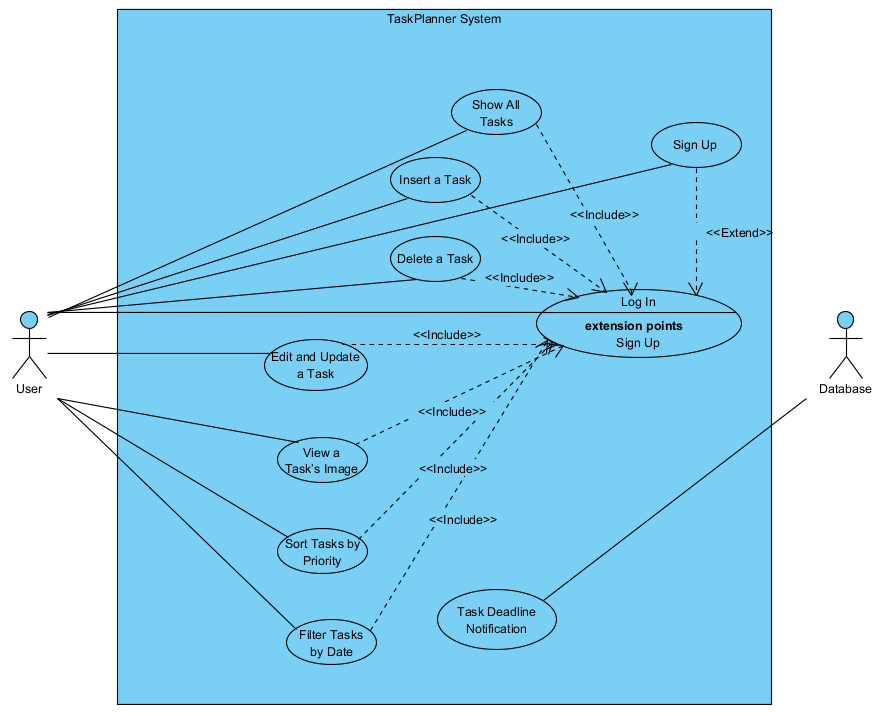

# 4 **Behavioral Models**

No explanation is needed here. Only complete the subsection.

## 4.1 **Sequence Diagram**

Put the image and explanation of your sequence diagram.

This diagram illustrates the main interactions between the User and TaskPlanner System for various use cases such as logging in, inserting a task, showing all tasks, deleting a task, updating a task, and viewing an image associated with a task. The diagram provides an overview of the actions and data flow between the actor in the system.

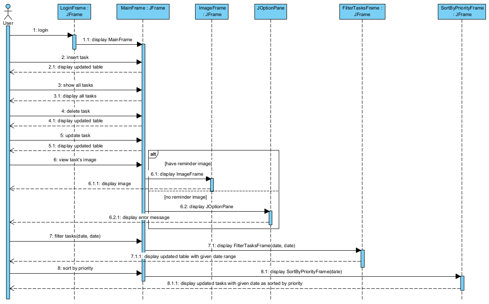

# 5 **Structural Models**

No explanation is needed here. Only complete the subsection.

## 5.1 **Class Diagram**

Put the image and explanation of your class diagram.

JFrame: Represents the base class for graphical frames in Java Swing.

LoginFrame: Represents the login frame where the user enters their username and password.

CreateAccountFrame: Represents the frame for creating a new user account.

MainFrame: Represents the main frame where the user interacts with the

task functionalities.

FilterTasksFrame: Represents the frame for filtering tasks based on date ranges.

SortByPriorityFrame: Represents the frame for sorting tasks by priority by given deadline.

ImageFrame: Represents the frame for displaying task images.

NotificationFrame: Represents the frame for displaying task deadline notifications.

JOptionPane: A class for displaying standard dialog boxes, such as error messages or notifications.

SqlConnection: Connection with database of the system which contains users and tasks.

Main: Creates the initial LoginFrame at start.

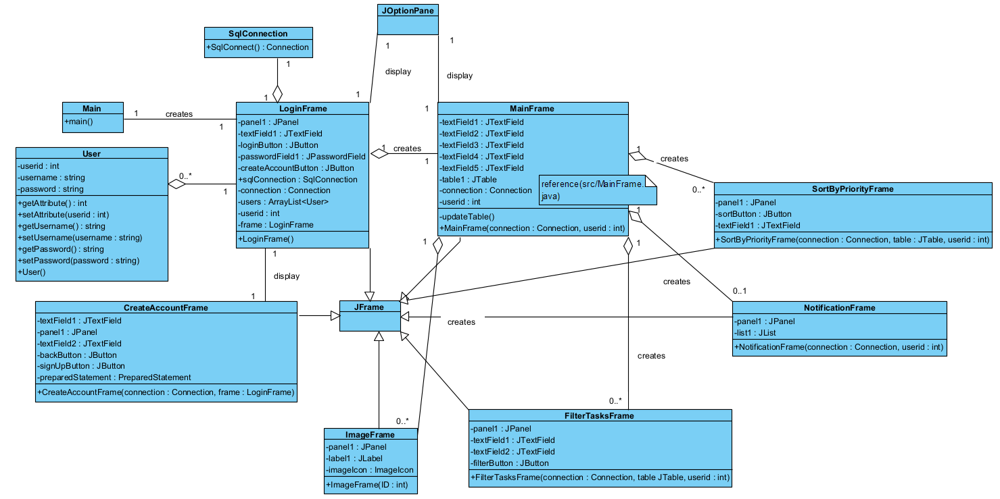

# 6 **Process Modeling**

No explanation is needed here. Only complete the subsection.

## 6.1**Data Flow Diagram (DFD)**

Put the images and the explanations of your Context Diagram and Level 0 DFD.

**TaskPlanner System:** Represents the system (your desktop application) that manages tasks and provides various functionalities.

**User:** Represents the external entity (user) who interacts with the TaskPlanner system.

**Context Level:**

.png)

**Level 0:**

.png)

# 7**Final Version(s) of the Graphical User Interface(s)**

Put the images of your GUIs, also put the output screenshots of each function that is tested with sample data. Briefly explain the purpose of each GUI. Do not forget to add the form title for each image.

**LoginFrame:**

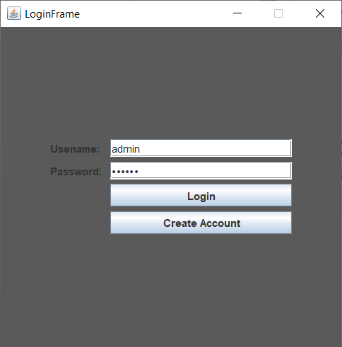

**NotificationFrame:**

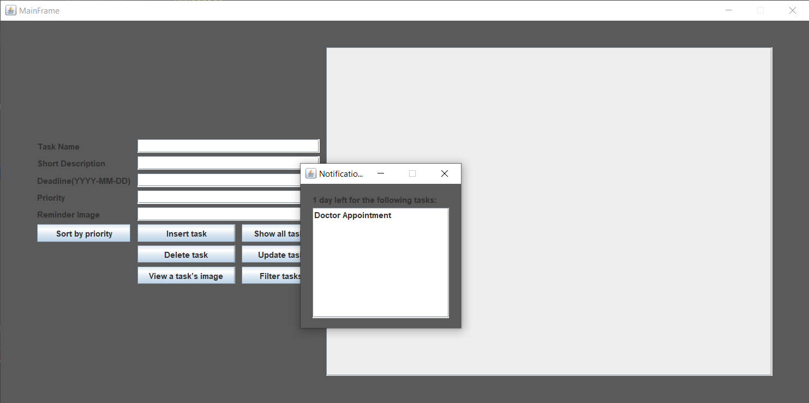

**MainFrame:**

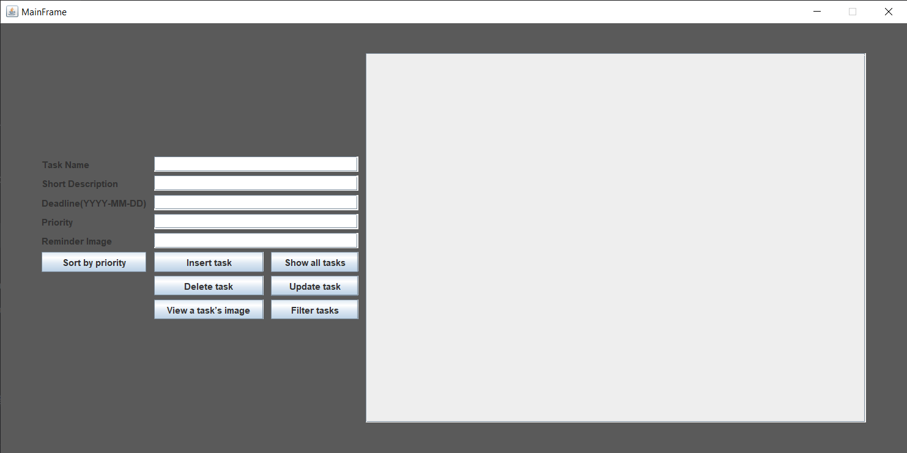

**Show all tasks:**

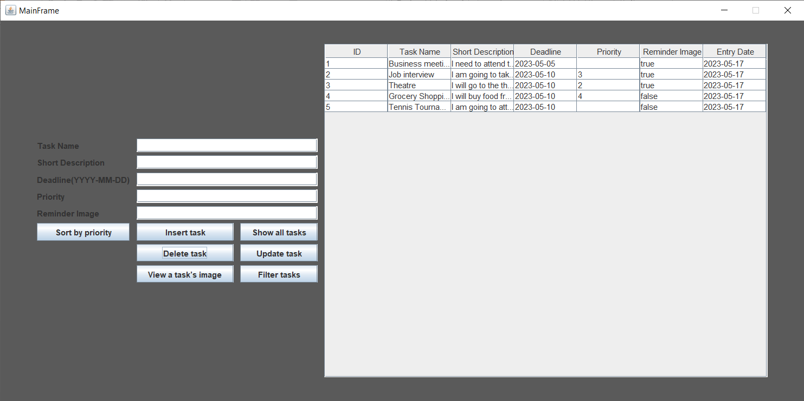

**Insert task:**

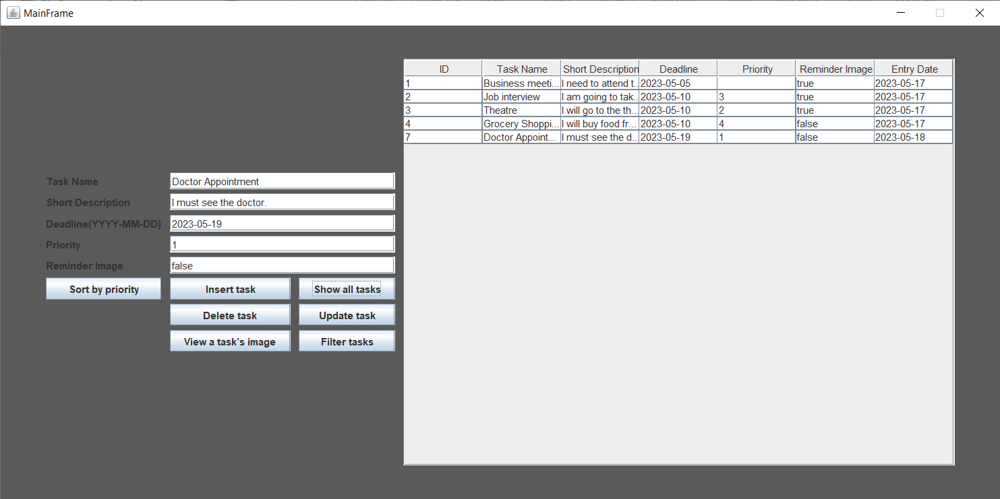

**View a task's image:**

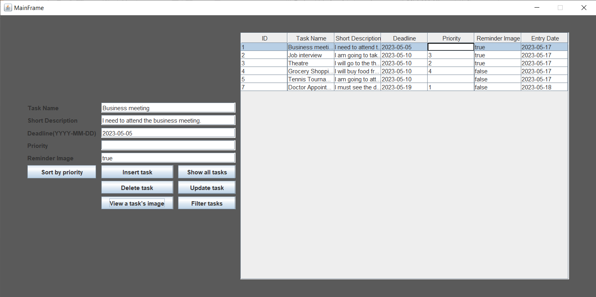

**Sort by priority:**

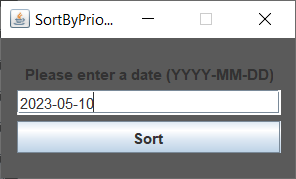

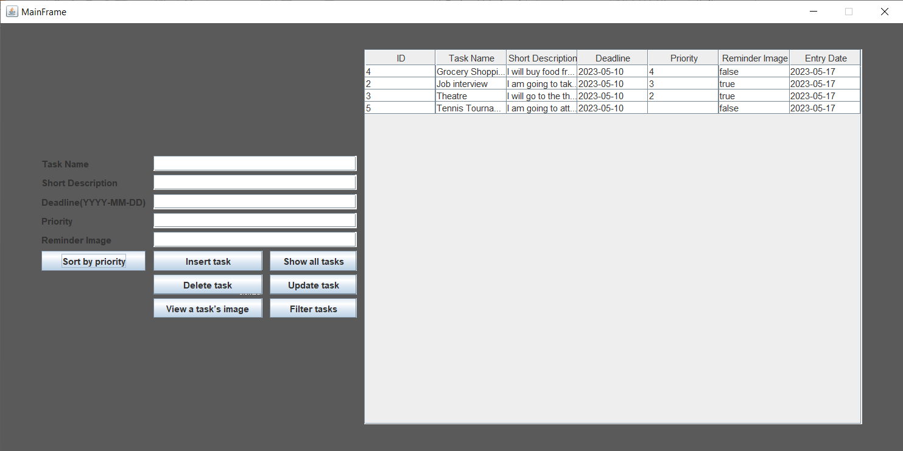

**Filter tasks:**

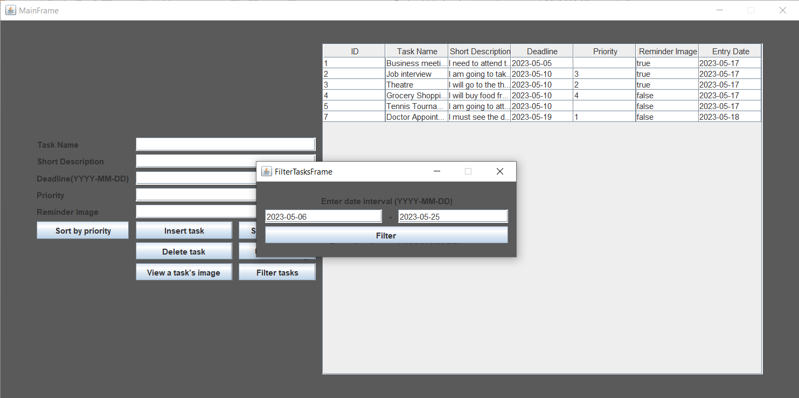

**Update task:**

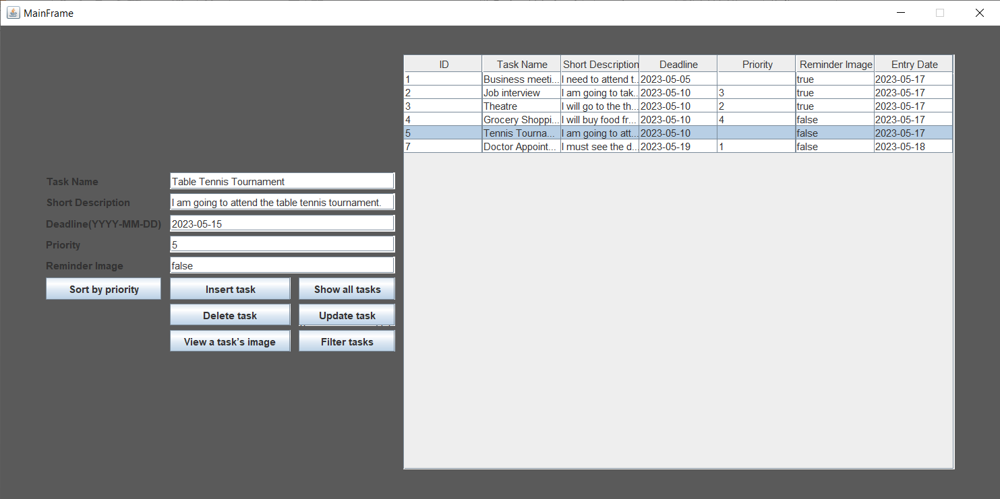

**Delete task:**

# 8 **Conclusion and Future Work**

Write a conclusion for your project and summarize your work. Also write what kind of features/functions can be added to your project.

Firstly, users can add, edit and delete their own tasks with this app. To do this, they need to create an account. After that, they will need to choose a name and deadline for the task they want to add. In addition, users will get notified about the tasks that have most one day left. Users can also filter and sort their tasks by using this app which will make it easier to see what should they do first. In short, users can easily arrange their tasks with this app and make their life easier.

In the future, customization options and selecting an image when inserting a task may be added for the table. Also more notification options may be added to the project.